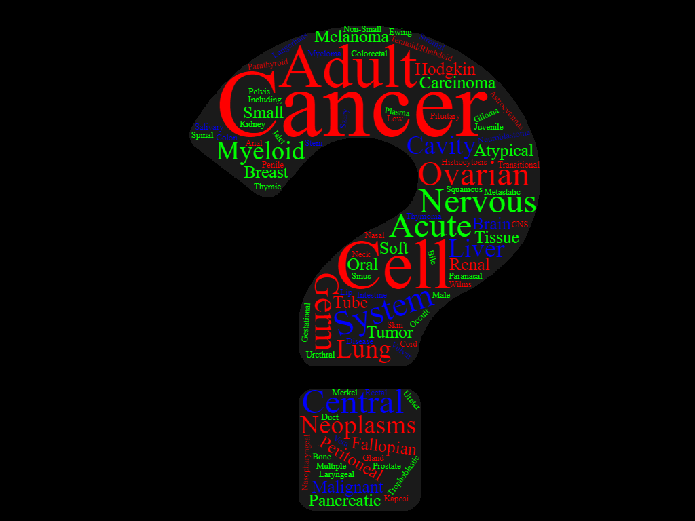

# DeepBioComp
# Cancer Ask :scorpion:



## About

We fine-tuned **[BioBERT](https://huggingface.co/dmis-lab/biobert-base-cased-v1.1-squad) (Bidirectional Encoder Representations from Transformers for Biomedical Text Mining)** model for short question types over cancer-related question answers and context texts, we called Cancer Ask. Further, we fine-tuned the **Generative Pre-trained Transformer 2 (GPT2)**, models over cancer-related text, we named it as GPT2 Cancer. Basic idea is to use answers from Cancer Ask :scorpion: and feed to GPT2 Cancer to extend the scope of the answer further to enhance the context.


### Table 1. List of the Cancer type and question type.

| Cancer type                                                       | Question type |
|-------------------------------------------------------------------|---------------|
| Ovarian Epithelial, Fallopian Tube, and Primary Peritoneal Cancer | 10            |
| Breast Cancer                                                     | 10            |
| Anal Cancer                                                       | 9             |
| Adult Central Nervous System Tumors                               | 9             |
| Childhood Astrocytomas                                            | 9             |
| Childhood Brain Stem Glioma                                       | 9             |
| Endometrial Cancer                                                | 9             |
| Childhood Extracranial Germ Cell Tumors                           | 9             |
| Retinoblastoma                                                    | 9             |
| Neuroblastoma                                                     | 9             |
| Prostate Cancer                                                   | 9             |
| Adult Acute Myeloid Leukemia                                      | 8             |
| Chronic Myelogenous Leukemia                                      | 8             |
| Hairy Cell Leukemia                                               | 8             |
| Childhood Acute Myeloid Leukemia and Other Myeloid Malignancies   | 8             |
| Adult Soft Tissue Sarcoma                                         | 8             |
| Childhood Soft Tissue Sarcoma                                     | 8             |
| Adult Hodgkin Lymphoma                                            | 8             |
| Adult Non-Hodgkin Lymphoma                                        | 8             |
| Childhood Hodgkin Lymphoma                                        | 8             |
| Childhood Central Nervous System Atypical Teratoid/Rhabdoid Tumor | 8             |
| Childhood Central Nervous System Germ Cell Tumors                 | 8             |
| Childhood Craniopharyngioma                                       | 8             |
| Childhood Ependymoma                                              | 8             |
| Adult Primary Liver Cancer                                        | 8             |
| Bile Duct Cancer (Cholangiocarcinoma)                             | 8             |
| Childhood Liver Cancer                                            | 8             |
| Osteosarcoma and Malignant Fibrous Histiocytoma of Bone           | 8             |
| Gastrointestinal Carcinoid Tumors                                 | 8             |
| Uterine Sarcoma                                                   | 8             |
| Extragonadal Germ Cell Tumors                                     | 8             |
| Intraocular (Uveal) Melanoma                                      | 8             |
| Gallbladder Cancer                                                | 8             |
| Gestational Trophoblastic Disease                                 | 8             |
| Langerhans Cell Histiocytosis                                     | 8             |
| Hypopharyngeal Cancer                                             | 8             |
| Laryngeal Cancer                                                  | 8             |
| Lip and Oral Cavity Cancer                                        | 8             |
| Nasopharyngeal Cancer                                             | 8             |
| Oropharyngeal Cancer                                              | 8             |
| Paranasal Sinus and Nasal Cavity Cancer                           | 8             |
| Salivary Gland Cancer                                             | 8             |
| Pancreatic Cancer                                                 | 8             |
| Wilms Tumor and Other Childhood Kidney Tumors                     | 8             |
| Male Breast Cancer                                                | 8             |
| Skin Cancer                                                       | 8             |
| Melanoma                                                          | 8             |
| Merkel Cell Carcinoma                                             | 8             |
| Non-Small Cell Lung Cancer                                        | 8             |
| Parathyroid Cancer                                                | 8             |
| Penile Cancer                                                     | 8             |
| Pituitary Tumors                                                  | 8             |
| Colon Cancer                                                      | 8             |
| Rectal Cancer                                                     | 8             |
| Adult Acute Lymphoblastic Leukemia                                | 7             |
| Chronic Lymphocytic Leukemia                                      | 7             |
| Childhood Acute Lymphoblastic Leukemia                            | 7             |
| Childhood Rhabdomyosarcoma                                        | 7             |
| Mycosis Fungoides and the Szary Syndrome                          | 7             |
| Childhood Non-Hodgkin Lymphoma                                    | 7             |
| Childhood Brain and Spinal Cord Tumors                            | 7             |
| Childhood Central Nervous System Embryonal Tumors                 | 7             |
| Ewing Sarcoma                                                     | 7             |
| Ovarian Germ Cell Tumors                                          | 7             |
| Ovarian Low Malignant Potential Tumors                            | 7             |
| Metastatic Squamous Neck Cancer with Occult Primary               | 7             |
| Pancreatic Neuroendocrine Tumors (Islet Cell Tumors)              | 7             |
| Transitional Cell Cancer of the Renal Pelvis and Ureter           | 7             |
| Plasma Cell Neoplasms (Including Multiple Myeloma)                | 7             |
| Small Cell Lung Cancer                                            | 7             |
| Small Intestine Cancer                                            | 7             |
| Thymoma and Thymic Carcinoma                                      | 7             |
| Urethral Cancer                                                   | 7             |
| Vulvar Cancer                                                     | 7             |
| Gastrointestinal Stromal Tumors                                   | 6             |
| AIDS-Related Lymphoma                                             | 6             |
| Primary CNS Lymphoma                                              | 6             |
| Testicular Cancer                                                 | 6             |
| Chronic Myelomonocytic Leukemia                                   | 5             |
| Kaposi Sarcoma                                                    | 4             |
| Childhood Vascular Tumors                                         | 4             |
| Liver (Hepatocellular) Cancer                                     | 4             |
| Chronic Myeloproliferative Neoplasms                              | 4             |
| Polycythemia Vera                                                 | 4             |
| Primary Myelofibrosis                                             | 4             |
| Essential Thrombocythemia                                         | 4             |
| Myelodysplastic/ Myeloproliferative Neoplasms                     | 4             |
| Juvenile Myelomonocytic Leukemia                                  | 4             |
| Atypical Chronic Myelogenous Leukemia                             | 4             |
| Ovarian, Fallopian Tube, and Primary Peritoneal Cancer            | 4             |
| Oral Cavity and Oropharyngeal Cancer                              | 4             |
| Renal Cell Cancer                                                 | 4             |
| Colorectal Cancer                                                 | 4             |
| Chronic Eosinophilic Leukemia                                     | 3             |
| Myelodysplastic/ Myeloproliferative Neoplasm, Unclassifiable      | 3             |
| Lung Cancer                                                       | 3             |
| Myelodysplastic Syndromes                                         | 2             |
| Chronic Neutrophilic Leukemia                                     | 2             |


## Reference
### Dataset
* [MedQuAD dataset](https://github.com/abachaa/MedQuAD/tree/master/1_CancerGov_QA), [ARTICLE](https://arxiv.org/abs/1901.08079) Abacha, A. B., & Demner-Fushman, D. (2019). A question-entailment approach to question answering. BMC bioinformatics, 20(1), 511.


```{bash}
export SQUAD_DIR=.

python run_squad.py \
    --model_type bert \
    --model_name_or_path dmis-lab/biobert-base-cased-v1.1-squad \
    --do_train \
    --do_eval \
    --version_2_with_negative \
    --train_file $SQUAD_DIR/Train_cancer_qa.json \
    --predict_file $SQUAD_DIR/Dev_cancer_qa.json \
    --learning_rate 3e-5 \
    --num_train_epochs 4 \
    --max_seq_length 384 \
    --doc_stride 128 \
    --output_dir ./BioBERT_Cancer/ \
    --per_gpu_eval_batch_size=1  \
    --per_gpu_train_batch_size=1   \
    --save_steps 5000

```

## License
[MIT](https://github.com/uabinf/nlp-group-project-fall-2020-deepbiocomp/blob/main/LICENSE)

## Google Drive
[link](https://drive.google.com/drive/folders/1YmDINjCupRHrTMihE9k8r8wTxL1H5UCv?usp=sharing)
