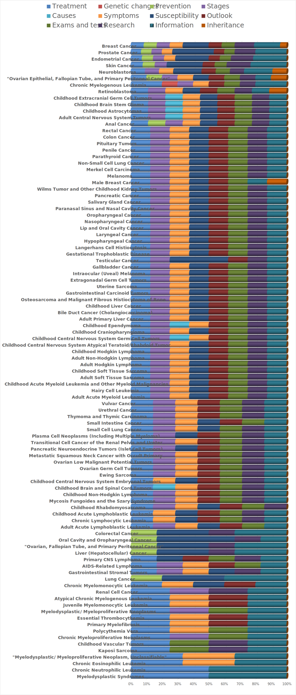

# Cancer Ask <!--:scorpion:-->:crab:
<p align="center">
    
</p>

## About

We fine-tuned **[BioBERT](https://huggingface.co/dmis-lab/biobert-base-cased-v1.1-squad) (Bidirectional Encoder Representations from Transformers for Biomedical Text Mining)** model for short question types over cancer-related question answers and context texts, we called Cancer Ask. Further, we fine-tuned the **Generative Pre-trained Transformer 2 (GPT2)**, models over cancer-related text, we named it as GPT2 Cancer. Basic idea is to use answers from Cancer Ask :crab: and feed to GPT2 Cancer to extend the scope of the answer further to enhance the context.

## Running the project

### Cloning DeepBioComp
To clone this project please enter below command in you terminal:
```bash
git clone https://github.com/uabinf/nlp-group-project-fall-2020-deepbiocomp
``` 

### Enviroment setup
To run this project you need to fullfill specific packages. Please run the following command in your terminal:
```bash
module load Anaconda3/2020.07
conda env create --file DeepBioComp.yml
```
_**NOTE:**_ This instructions only works if you are using [Cheaha Supercomputer](https://www.uab.edu/it/home/research-computing/cheaha).

### Running Jupyter Notebooks on Cheaha
To run Jupyter Notebook and Python kernal please run the following command in your Cheaha termial:
```bash
sbatch scripts/job_script/CS762_pascal_Cheaha.job
```
This Slurm job script will create an output file with appropriate resources. Example output file:
file name: `jupyter-log-pascal-CS762-<JOB_ID>.txt`
```
Name of the cluster on which the job is executing. slurm_cluster
Number of tasks to be initiated on each node. 1
Number of cpus requested per task. 16
Number of CPUS on the allocated node. 16
Total number of processes in the current job.
List of nodes allocated to the job c0109
Total number of nodes in the job's resource allocation. 1
List of allocated GPUs. 0,1,2,3

The following have been reloaded with a version change:
  1) Anaconda3/2020.02 => Anaconda3/2020.07


   Copy/Paste this in your local terminal to ssh tunnel with remote
   ------------------------------------------------------------------
   ssh -L 9081:172.20.201.109:9081 <YOUR_USER_NAME>@cheaha.rc.uab.edu
   ------------------------------------------------------------------


   Then open a browser on your local machine to the following address
   ------------------------------------------------------------------
   localhost:9081
   ------------------------------------------------------------------


[I 22:11:08.513 NotebookApp] Serving notebooks from local directory: /data/user/<YOUR_USER_NAME>
[I 22:11:08.513 NotebookApp] Jupyter Notebook 6.1.5 is running at:
[I 22:11:08.513 NotebookApp] http://172.20.201.109:9081/?token=<JUPYTER_SECURITY_KEY_TOKEN>
[I 22:11:08.513 NotebookApp]  or http://127.0.0.1:9081/?token=<JUPYTER_SECURITY_KEY_TOKEN>
[I 22:11:08.513 NotebookApp] Use Control-C to stop this server and shut down all kernels (twice to skip confirmation).
[C 22:11:08.536 NotebookApp]

    To access the notebook, open this file in a browser:
        file:///home/<YOUR_USER_NAME>/.local/share/jupyter/runtime/nbserver-18353-open.html
    Or copy and paste one of these URLs:
        http://172.20.201.109:9081/?token=<JUPYTER_SECURITY_KEY_TOKEN>
     or http://127.0.0.1:9081/?token=<JUPYTER_SECURITY_KEY_TOKEN>

```

Now, to open Jupyter nootbook in your local machine browser, please run the commands that are mention in your output file, on your local terminal (Based on previous example):

**Step 1:**
```bash
ssh -L 9081:172.20.201.109:9081 <YOUR_USER_NAME>@cheaha.rc.uab.edu
```
_**NOTE:**_ you need to replace _"<YOUR_USER_NAME>"_ with your _user id_ on Cheaha. **DO NOT CLOSE THE TERMINAL, AND MAKE SURE YOU ARE CONNECTED TO INTERNET.**

**Step 2:**
Open your choice of browser and type link that is mention in your output file (Based on previous example):
```
http://localhost:9081/?token=<JUPYTER_SECURITY_KEY_TOKEN>
```
_**NOTE:**_ you need to replace IP address _"172.20.201.109"_ with _"localhost"_, and _<JUPYTER_SECURITY_KEY_TOKEN>_ with the _key_ mention in your output file.


## Dataset
In this project we are using Cancer dataset, which are published as `MedQuAD` dataset. This dataset is specifically created for medical question-answering. The dataset created from 12 NIH websites (e.g. cancer.gov, niddk.nih.gov, GARD, MedlinePlus Health Topics).
<p align="center">
    
</p>
As shown above figure, the Cancer dataset are focused on 98 types of cancers, and each type of cancer can have maximum 12 types of questions. In total we have 729 questions, and their questions types are distributed as follow:
</br>
</br>

| Question type    | Count |
|------------------|-------|
| Information      | 112   |
| Treatment        | 95    |
| Susceptibility   | 88    |
| Research         | 86    |
| Symptoms         | 82    |
| Exams and tests  | 82    |
| Outlook          | 82    |
| Stages           | 77    |
| Prevention       | 12    |
| Causes           | 7     |
| Inheritance      | 5     |
| Genetic changes  | 1     |

## List of Files
* Data Prepare Script:
	* [`data-prepare-script_QA.ipynb`](https://github.com/uabinf/nlp-group-project-fall-2020-deepbiocomp/blob/main/dataset/data-prepare-script/data-prepare-script_QA.ipynb) - This file parse all raw XML data, and collect appropriate informations for Question-Answer model and save them to JSON format. However, created JSON data were not enough and correct to train the model.
	* [`data-prepare-script_text-generation.ipynb`](https://github.com/uabinf/nlp-group-project-fall-2020-deepbiocomp/blob/main/dataset/data-prepare-script/data-prepare-script_text-generation.ipynb) - This file parse all raw XML data, and collect appropriate informations for Text-Generation model and save them to JSON format. However, created JSON data still needed cleaning.
	* [`new-data-prepare-script_QA.ipynb`](https://github.com/uabinf/nlp-group-project-fall-2020-deepbiocomp/blob/main/dataset/data-prepare-script/new-data-prepare-script_QA.ipynb) - This file parse all raw XML data, and collect appropriate informations for Question-Answer model and save them to JSON format. This JSON data are complete and cleaned.
	* [`new-data-prepare-script_text-generation.ipynb`](https://github.com/uabinf/nlp-group-project-fall-2020-deepbiocomp/blob/main/dataset/data-prepare-script/new-data-prepare-script_text-generation.ipynb) - This file parse all raw XML data, and collect appropriate informations for Text-Generation model and save them to JSON format. This JSON data are complete and cleaned.
	* [`RWA_to_Json_for-new-data.ipynb`](https://github.com/uabinf/nlp-group-project-fall-2020-deepbiocomp/blob/main/dataset/data-prepare-script/RWA_to_Json_for-new-data.ipynb) - This file parse manual developer format dataset, collect appropriate informations, and save them to JSON format.
* Question-Answer Task Script:
	* [`qa_squad_v1.ipynb`](https://github.com/uabinf/nlp-group-project-fall-2020-deepbiocomp/blob/main/scripts/qa_script/qa_squad_v1.ipynb) - This file is to fine tune the BERT model, by first loading the weights dmis-lab/biobert-base-cased-v1.1-squad and then train on MedQuAD Cancer dataset.
	* [`Attention_qa_model.ipynb`](https://github.com/uabinf/nlp-group-project-fall-2020-deepbiocomp/blob/main/scripts/qa_script/Attention_qa_model.ipynb) - This file is to visualize layer wise attetions based on trained BioBERT model on MedQuAD Cancer dataset.
	* [`args.json`](https://github.com/uabinf/nlp-group-project-fall-2020-deepbiocomp/blob/main/scripts/qa_script/args.json) - This file automatically created when you run the `qa_squad_v1.ipynb` file.
* Text-Generation Task Script:
	* [`text_generator_GPT2_v1.ipynb`](https://github.com/uabinf/nlp-group-project-fall-2020-deepbiocomp/blob/main/scripts/text_generation_script/text_generator_GPT2_v1.ipynb) - This file is to fine tune the GPT-2 model, by first loading the weights gpt2 and then train on MedQuAD Cancer dataset.
	* [`Attention_text-generation_model.ipynb`](https://github.com/uabinf/nlp-group-project-fall-2020-deepbiocomp/blob/main/scripts/text_generation_script/Attention_text-generation_model.ipynb) - This file is to visualize layer wise attetions based on trained GPT-2 model on MedQuAD Cancer dataset.
	* [`args.json`](https://github.com/uabinf/nlp-group-project-fall-2020-deepbiocomp/blob/main/scripts/text_generation_script/args.json) - This file automatically created when you run the `text_generator_GPT2_v1.ipynb` file.
* Combine (Question-Answer and Text-Generation) Task Script:
	* [`combine-qa-text_greneration_v1_run1.ipynb`](https://github.com/uabinf/nlp-group-project-fall-2020-deepbiocomp/blob/main/scripts/combine-qa-text_greneration/combine-qa-text_greneration_v1_run1.ipynb) and [`combine-qa-text_greneration_v1_run2.ipynb`](https://github.com/uabinf/nlp-group-project-fall-2020-deepbiocomp/blob/main/scripts/combine-qa-text_greneration/combine-qa-text_greneration_v1_run2.ipynb) - This file is to load our fine tuned models (BERT and GPT-2) which are trained on MedQuAD Cancer dataset, and then prediting Answer and Long Answer.
* Slurm Job Script:
	* [`CS762_pascal_Cheaha.job`](https://github.com/uabinf/nlp-group-project-fall-2020-deepbiocomp/blob/main/scripts/job_script/CS762_pascal_Cheaha.job) - This file is to submit job in Slurm manager, to get compute node on Cheaha supercomputer.


## Reference
* Code
	* [Transformers](https://github.com/huggingface/transformers)
	* [Transformers - QA example](https://github.com/huggingface/transformers/blob/master/examples/question-answering/run_squad.py)
	* Suraj Patil's [notebook example](https://github.com/patil-suraj/Notebooks/blob/master/longformer_qa_training.ipynb)
	* Old version of [Transformers - Language modeling example](https://github.com/huggingface/transformers/blob/master/examples/contrib/legacy/run_language_modeling.py)
	* Old version of [Transformers - Language model generation example](https://github.com/huggingface/transformers/blob/master/examples/text-generation/run_generation.py)
* Dataset
	* [MedQuAD dataset](https://github.com/abachaa/MedQuAD/tree/master/1_CancerGov_QA), [ARTICLE](https://arxiv.org/abs/1901.08079) Abacha, A. B., & Demner-Fushman, D. (2019). A question-entailment approach to question answering. BMC bioinformatics, 20(1), 511.

## License
[MIT](https://github.com/uabinf/nlp-group-project-fall-2020-deepbiocomp/blob/main/LICENSE)

## Contact Information
For help or issues using Cancer ASK, please submit a GitHub issue. Please contact Nilesh Kumar (nileshkr (at) uab.edu),  Mirza Sami (mtsami(at)uab.edu), and Trupesh Patel (tr27p(at)uab.edu) for communication related to Cancer ASK.
