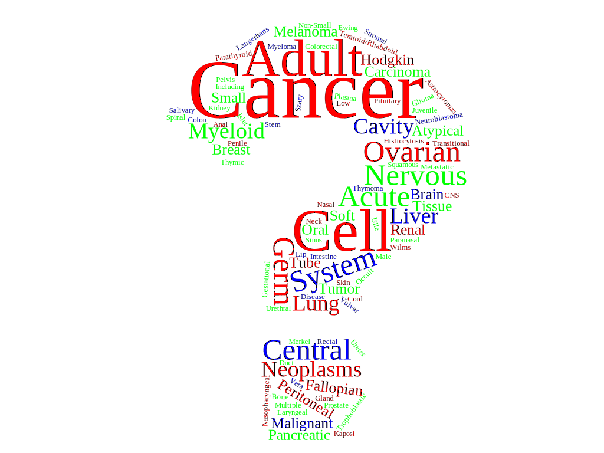
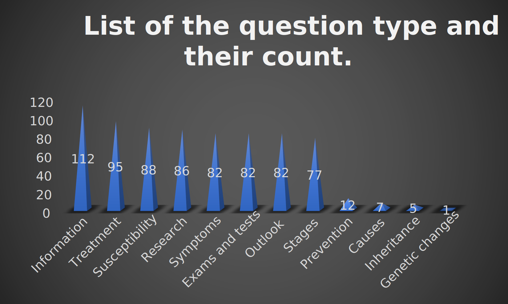

# DeepBioComp
## Cancer Ask <!--:scorpion:-->:crab:
<p align="center">
    
</p>

## About

We fine-tuned **[BioBERT](https://huggingface.co/dmis-lab/biobert-base-cased-v1.1-squad) (Bidirectional Encoder Representations from Transformers for Biomedical Text Mining)** model for short question types over cancer-related question answers and context texts, we called Cancer Ask. Further, we fine-tuned the **Generative Pre-trained Transformer 2 (GPT2)**, models over cancer-related text, we named it as GPT2 Cancer. Basic idea is to use answers from Cancer Ask :crab: and feed to GPT2 Cancer to extend the scope of the answer further to enhance the context.

## Running the project

### Cloning DeepBioComp
To clone this project please enter below command in you terminal:
```bash
git clone https://github.com/uabinf/nlp-group-project-fall-2020-deepbiocomp
``` 

### Enviroment setup
To run this project you need to fullfill specific packages. Please run the following command in your terminal:
```bash
module load Anaconda3/2020.07
conda env create --file DeepBioComp.yml
```
**NOTE:** This instructions only works if you are using [Cheaha Supercomputer](https://www.uab.edu/it/home/research-computing/cheaha).

### Running Jupyter Notebooks on Cheaha
To run Jupyter Notebook and Python kernal please run the following command in your Cheaha termial:
```bash
sbatch scripts/job_script/CS762_pascal_Cheaha.job
```
This Slurm job script will create an output file with appropriate resources. Example output file:
file name: jupyter-log-pascal-CS762-<JOB_ID>.txt
```
Name of the cluster on which the job is executing. slurm_cluster
Number of tasks to be initiated on each node. 1
Number of cpus requested per task. 16
Number of CPUS on the allocated node. 16
Total number of processes in the current job.
List of nodes allocated to the job c0109
Total number of nodes in the job's resource allocation. 1
List of allocated GPUs. 0,1,2,3

The following have been reloaded with a version change:
  1) Anaconda3/2020.02 => Anaconda3/2020.07


   Copy/Paste this in your local terminal to ssh tunnel with remote
   ------------------------------------------------------------------
   ssh -L 9081:172.20.201.109:9081 <YOUR_USER_NAME>@cheaha.rc.uab.edu
   ------------------------------------------------------------------


   Then open a browser on your local machine to the following address
   ------------------------------------------------------------------
   localhost:9081
   ------------------------------------------------------------------


[I 22:11:08.513 NotebookApp] Serving notebooks from local directory: /data/user/<YOUR_USER_NAME>
[I 22:11:08.513 NotebookApp] Jupyter Notebook 6.1.5 is running at:
[I 22:11:08.513 NotebookApp] http://172.20.201.109:9081/?token=<JUPYTER_SECURITY_KEY_TOKEN>
[I 22:11:08.513 NotebookApp]  or http://127.0.0.1:9081/?token=<JUPYTER_SECURITY_KEY_TOKEN>
[I 22:11:08.513 NotebookApp] Use Control-C to stop this server and shut down all kernels (twice to skip confirmation).
[C 22:11:08.536 NotebookApp]

    To access the notebook, open this file in a browser:
        file:///home/<YOUR_USER_NAME>/.local/share/jupyter/runtime/nbserver-18353-open.html
    Or copy and paste one of these URLs:
        http://172.20.201.109:9081/?token=<JUPYTER_SECURITY_KEY_TOKEN>
     or http://127.0.0.1:9081/?token=<JUPYTER_SECURITY_KEY_TOKEN>

```

Now, to open Jupyter nootbook in your local machine browser, please run the commands that are mention in your output file, on your local terminal (Based on previous example):
Step 1:
```bash
ssh -L 9081:172.20.201.109:9081 <YOUR_USER_NAME>@cheaha.rc.uab.edu
```
**NOTE:** you need to replace "<YOUR_USER_NAME>" with your user id on Cheaha. DO NOT CLOSE THE TERMINAL, AND MAKE SURE YOU ARE CONNECTED TO INTERNET.

Step 2:
Open your choice of browser and type link that is mention in your output file (Based on previous example):
```
http://localhost:9081/?token=<JUPYTER_SECURITY_KEY_TOKEN>
```
**NOTE:** you need to replace IP address "172.20.201.109" with "localhost", and <JUPYTER_SECURITY_KEY_TOKEN> with the key mention in your output file.

<!--


### Table 1. List of the Cancer type and question type.

| Cancer type                                                       | Question type |
|-------------------------------------------------------------------|---------------|
| Ovarian Epithelial, Fallopian Tube, and Primary Peritoneal Cancer | 10            |
| Breast Cancer                                                     | 10            |
| Anal Cancer                                                       | 9             |
| Adult Central Nervous System Tumors                               | 9             |
| Childhood Astrocytomas                                            | 9             |
| Childhood Brain Stem Glioma                                       | 9             |
| Endometrial Cancer                                                | 9             |
| Childhood Extracranial Germ Cell Tumors                           | 9             |
| Retinoblastoma                                                    | 9             |
| Neuroblastoma                                                     | 9             |
| Prostate Cancer                                                   | 9             |
| Adult Acute Myeloid Leukemia                                      | 8             |
| Chronic Myelogenous Leukemia                                      | 8             |
| Hairy Cell Leukemia                                               | 8             |
| Childhood Acute Myeloid Leukemia and Other Myeloid Malignancies   | 8             |
| Adult Soft Tissue Sarcoma                                         | 8             |
| Childhood Soft Tissue Sarcoma                                     | 8             |
| Adult Hodgkin Lymphoma                                            | 8             |
| Adult Non-Hodgkin Lymphoma                                        | 8             |
| Childhood Hodgkin Lymphoma                                        | 8             |
| Childhood Central Nervous System Atypical Teratoid/Rhabdoid Tumor | 8             |
| Childhood Central Nervous System Germ Cell Tumors                 | 8             |
| Childhood Craniopharyngioma                                       | 8             |
| Childhood Ependymoma                                              | 8             |
| Adult Primary Liver Cancer                                        | 8             |
| Bile Duct Cancer (Cholangiocarcinoma)                             | 8             |
| Childhood Liver Cancer                                            | 8             |
| Osteosarcoma and Malignant Fibrous Histiocytoma of Bone           | 8             |
| Gastrointestinal Carcinoid Tumors                                 | 8             |
| Uterine Sarcoma                                                   | 8             |
| Extragonadal Germ Cell Tumors                                     | 8             |
| Intraocular (Uveal) Melanoma                                      | 8             |
| Gallbladder Cancer                                                | 8             |
| Gestational Trophoblastic Disease                                 | 8             |
| Langerhans Cell Histiocytosis                                     | 8             |
| Hypopharyngeal Cancer                                             | 8             |
| Laryngeal Cancer                                                  | 8             |
| Lip and Oral Cavity Cancer                                        | 8             |
| Nasopharyngeal Cancer                                             | 8             |
| Oropharyngeal Cancer                                              | 8             |
| Paranasal Sinus and Nasal Cavity Cancer                           | 8             |
| Salivary Gland Cancer                                             | 8             |
| Pancreatic Cancer                                                 | 8             |
| Wilms Tumor and Other Childhood Kidney Tumors                     | 8             |
| Male Breast Cancer                                                | 8             |
| Skin Cancer                                                       | 8             |
| Melanoma                                                          | 8             |
| Merkel Cell Carcinoma                                             | 8             |
| Non-Small Cell Lung Cancer                                        | 8             |
| Parathyroid Cancer                                                | 8             |
| Penile Cancer                                                     | 8             |
| Pituitary Tumors                                                  | 8             |
| Colon Cancer                                                      | 8             |
| Rectal Cancer                                                     | 8             |
| Adult Acute Lymphoblastic Leukemia                                | 7             |
| Chronic Lymphocytic Leukemia                                      | 7             |
| Childhood Acute Lymphoblastic Leukemia                            | 7             |
| Childhood Rhabdomyosarcoma                                        | 7             |
| Mycosis Fungoides and the Szary Syndrome                          | 7             |
| Childhood Non-Hodgkin Lymphoma                                    | 7             |
| Childhood Brain and Spinal Cord Tumors                            | 7             |
| Childhood Central Nervous System Embryonal Tumors                 | 7             |
| Ewing Sarcoma                                                     | 7             |
| Ovarian Germ Cell Tumors                                          | 7             |
| Ovarian Low Malignant Potential Tumors                            | 7             |
| Metastatic Squamous Neck Cancer with Occult Primary               | 7             |
| Pancreatic Neuroendocrine Tumors (Islet Cell Tumors)              | 7             |
| Transitional Cell Cancer of the Renal Pelvis and Ureter           | 7             |
| Plasma Cell Neoplasms (Including Multiple Myeloma)                | 7             |
| Small Cell Lung Cancer                                            | 7             |
| Small Intestine Cancer                                            | 7             |
| Thymoma and Thymic Carcinoma                                      | 7             |
| Urethral Cancer                                                   | 7             |
| Vulvar Cancer                                                     | 7             |
| Gastrointestinal Stromal Tumors                                   | 6             |
| AIDS-Related Lymphoma                                             | 6             |
| Primary CNS Lymphoma                                              | 6             |
| Testicular Cancer                                                 | 6             |
| Chronic Myelomonocytic Leukemia                                   | 5             |
| Kaposi Sarcoma                                                    | 4             |
| Childhood Vascular Tumors                                         | 4             |
| Liver (Hepatocellular) Cancer                                     | 4             |
| Chronic Myeloproliferative Neoplasms                              | 4             |
| Polycythemia Vera                                                 | 4             |
| Primary Myelofibrosis                                             | 4             |
| Essential Thrombocythemia                                         | 4             |
| Myelodysplastic/ Myeloproliferative Neoplasms                     | 4             |
| Juvenile Myelomonocytic Leukemia                                  | 4             |
| Atypical Chronic Myelogenous Leukemia                             | 4             |
| Ovarian, Fallopian Tube, and Primary Peritoneal Cancer            | 4             |
| Oral Cavity and Oropharyngeal Cancer                              | 4             |
| Renal Cell Cancer                                                 | 4             |
| Colorectal Cancer                                                 | 4             |
| Chronic Eosinophilic Leukemia                                     | 3             |
| Myelodysplastic/ Myeloproliferative Neoplasm, Unclassifiable      | 3             |
| Lung Cancer                                                       | 3             |
| Myelodysplastic Syndromes                                         | 2             |
| Chronic Neutrophilic Leukemia                                     | 2             |


## Reference
### Dataset
* [MedQuAD dataset](https://github.com/abachaa/MedQuAD/tree/master/1_CancerGov_QA), [ARTICLE](https://arxiv.org/abs/1901.08079) Abacha, A. B., & Demner-Fushman, D. (2019). A question-entailment approach to question answering. BMC bioinformatics, 20(1), 511.

## License
[MIT](https://github.com/uabinf/nlp-group-project-fall-2020-deepbiocomp/blob/main/LICENSE)

## Google Drive
[link](https://drive.google.com/drive/folders/1YmDINjCupRHrTMihE9k8r8wTxL1H5UCv?usp=sharing)
